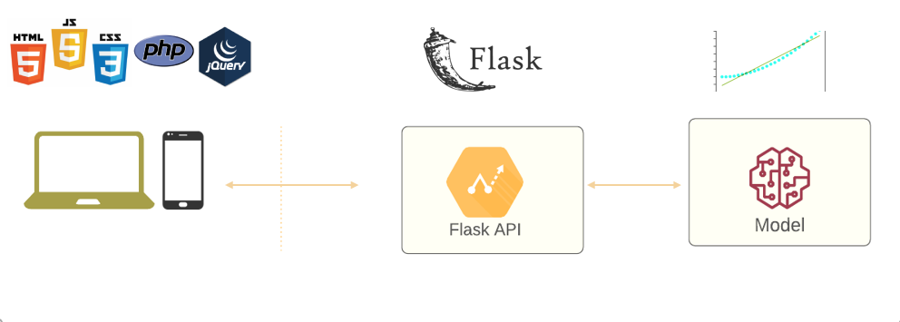

# Deploy de um Projeto de Machine Learnin com Flask: Previsão de Falha de Maquinário

    

## Introdução
Quando estou sobre dados, principalmente voltados a aprendizado de máquina, nos deparamos com uma imensidade de projetos sobre o assunto mostrando uma variedade de métricas, algoritmos, tipos de modelos, métodos de ajustes de parâmetros e muitos outros aspectos de construção de um algoritmo de aprendizagem de máquina.

Mas o que acontece depois de achar o modelo ideal? O que acontece após encontrar com 99,99% de acurácia um modelo que prevê o cancelamento de um serviço? O faturamento do próximo mês?

Acredito que boa parte dos projetos de Machine Learning param nesta etapa, ou porque o objetivo era esse mesmo ou por falta de propósito final para o algoritmo. Pensando nisso, vamos nesse post desenvolver um modelo de machine learning e fazer o deploy desse modelo por meio de uma API com a biblioteca Flask do python

## Etapas do Projeto
- Sobre o Projeto
- Importação e Análises Iniciais
- Treinamento e Avaliação do Modelo
- Testes e Finalização da Etapa de Modelagem
- Considerações Finais sobre a etapa de modelagem
- Criação da API para Deploy do Modelo
- Considerações Finais

Este post teve o objetivo de apresentar um formato simples para o deploy de um modelo de machine learning utilizando Flask para a construção de uma API.

Existem muitas outras possibilidades de melhoria para este processo, tanto em relação ao modelo quanto à API. No que diz respeito ao modelo, é possível ajustar parâmetros e treinar outros algoritmos de machine learning para melhorar o desempenho. Em relação à API, é importante estabelecer autenticações de segurança e realizar o deploy em um servidor na nuvem para garantir escalabilidade e confiabilidade.

Com essas melhorias, é possível criar uma solução mais robusta e eficiente, pronta para uso em produção.
